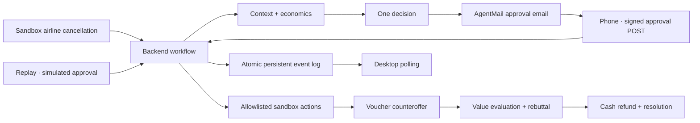

# STEWARD

**When plans break, Steward fixes them.**

When your flight is cancelled, the airline emails you a problem. It should email your agent instead.

Steward connects six consequences, evaluates three recovery options, asks for one approval, then handles the booking, meeting, notification, and refund. When the airline offers a larger voucher, Steward compares its value to Vincent and insists on cash.


## Run

Node 22 or newer.

```sh
npm ci
npm start
```

Open **http://localhost:3000** and select **See Steward take over**. Without email configuration, the decision card opens a signed local approval page. Approve there; the desktop continues automatically.

**Replay** in the footer (or Shift+R) runs the same event schema with simulated approval. It is always available. **Reset** returns the display to calm without cancelling a previously authorized recovery. Browser reload restores the current run.

## Real phone approval

Copy `.env.example` to `.env` and configure:

| Variable            | Purpose                                                  |
| ------------------- | -------------------------------------------------------- |
| `AGENTMAIL_API_KEY` | Server-only credential for the existing inbox            |
| `APPROVAL_EMAIL`    | Vincent's real approval recipient                        |
| `PUBLIC_BASE_URL`   | Public HTTPS origin accessible from the phone            |
| `APPROVAL_SECRET`   | Stable random signing secret for deployed approval links |
| `PORT`              | Server port; defaults to 3000                            |
| `WORKFLOW_PACE`     | Backend presentation pacing; defaults to 1               |

The communication identity is **steward-agent@agentmail.to**. No inbox is created. Configured live runs send a sandbox cancellation through that inbox, await a matching received message, validate its fixed payload, then send the approval email. Only generated protocol messages are interpreted; unrelated email is never an instruction.

The approval URL carries the run ID, decision ID, expiry, and HMAC-SHA256 signature. Opening the link does **not** approve it; the phone displays the plan and the user explicitly taps the approval button. This prevents email scanners from authorizing actions. The POST is idempotent. The desktop polls its durable run every 650 ms and resumes without laptop interaction.

Email outages are visible in the event log and fall back to a local approval link. Cancellation transport outages fall back to a direct sandbox event. The interface never labels local delivery as sent email. Never retry an ambiguous send blindly; the adapter uses a stable idempotency key and disables automatic retries.

## What is real?

| Real                                                      | Sandboxed                                              |
| --------------------------------------------------------- | ------------------------------------------------------ |
| HTTP cancellation trigger, workflow, economic decisions   | Flight inventory and airline persona                   |
| Persistent runs, event log, approvals, action receipts    | Booking, money movement, Sarah and calendar            |
| Signed phone approval, desktop continuation               | Airline voucher and cash refund                        |
| AgentMail cancellation and approval email when configured | Counterparty messages use a durable in-process mailbox |

No real airline purchase, calendar OAuth or bank transaction occurs. The agent autonomously calls allowlisted sandbox tools after approval. UI state derives from backend events rather than animation timers.

## Economics

Seven seeded flights are checked for availability and arrival before the meeting, with a 90-minute arrival buffer. Exactly three recovery choices remain:

- **A:** free rebooking tomorrow at 3 PM; misses the 9 AM meeting.
- **B:** $504 alternative tonight minus the $412 refund = **+$92 net**; saves the meeting and 31,000 miles.
- **C:** spend 31,000 miles worth approximately $560 for December to avoid $92 cash; poor value.

The seeded credit-use probability is 35%. A $450 airline-locked voucher has an estimated expected-use value of $158, versus $412 flexible cash. The probability is a synthetic user preference, not a prediction from an external service. Refund eligibility assumes the original flight was cancelled and Vincent declines that carrier's rebooking and voucher. [DOT refund policy](https://www.transportation.gov/individuals/aviation-consumer-protection/refunds) supports this seeded case. Refunds in the demo occur instantly; real processing times differ.

## Architecture



- `src/domain.js`: explicit economic rules and seeded context.
- `src/types.d.ts`: domain vocabulary and state types.
- `src/workflow.js`: approval gate, recovery, resumption and shared replay progression.
- `src/simulator.js`: allowlisted, idempotent airline commands and durable message receipts.
- `src/approval.js`: expiring signed links.
- `src/store.js`: atomic run/event persistence in `.data/`.
- `src/mail.js`: official AgentMail SDK adapter, existing inbox only.
- `public/`: custom responsive interface, reduced-motion support and expandable live proof.

The disk store intentionally targets one process on a persistent volume. Horizontal scaling requires replacing it with a transactional database. Runtime artifacts, tokens and secrets are ignored by Git. Run IDs are unguessable capability identifiers; this demo does not include accounts.

## Verify

```sh
npm test
npm run check
# Start the app, then:
npm run test:e2e
# Optional silent stage fallback capture:
npm run record:demo
```

Playwright needs Chromium (`npx playwright install chromium` if absent). Browser tests run two consecutive separate mobile-session approvals and desktop continuations, restore state after reload, complete the counteroffer, and exercise replay. They do not prove delivery to a physical phone. Before stage use, perform the actual email → physical phone → desktop flow twice.

## Demo and deployment

See [stage runbook](docs/DEMO.md), [video script](docs/VIDEO.md), and [build notes](docs/BUILD-NOTES.md).

A Dockerfile is included. Deploy one instance, mount persistent storage at `/app/.data`, configure the four email/approval variables, and route a public HTTPS origin to port 3000. No deployment resource has been created automatically. `/api/health` reports readiness without exposing credentials.

## Sponsors

**AgentMail** powers the configured communication path using its official SDK and skills. Other sponsors are deliberately unintegrated; the demo runs independently of their services.

MIT licensed. Contributions should preserve the one-story approval gate and deterministic economics.
