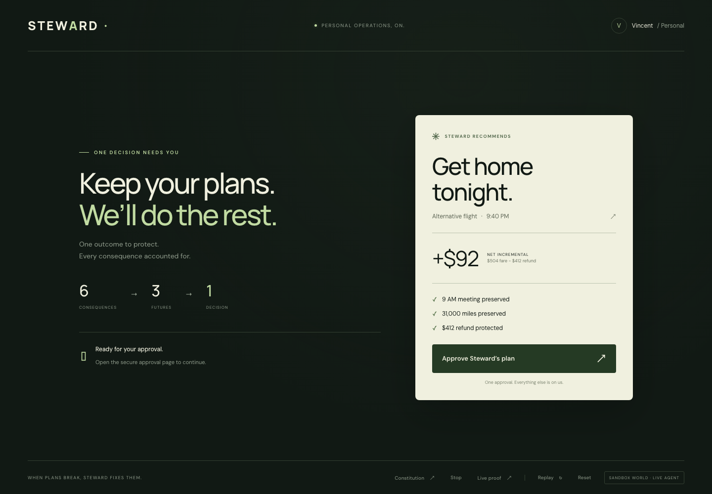
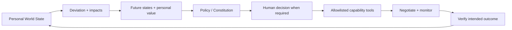

# STEWARD

**When plans break, Steward fixes them.**

When your flight is cancelled, the airline emails you a problem. It should email your agent instead.

**A personal outcome recovery system. Agents execute tasks. Steward restores outcomes.**

Steward models what matters, detects deviations, compares possible futures, compresses the consequences into one decision, acts within a human mandate, negotiates, and verifies the intended outcome. Travel recovery is today’s deeply functional capability; other domains are labeled concept previews.



## Run

Node 22 or newer.

```sh
npm ci
npm start
```

Open **http://localhost:3000** and select **See Steward take over**. Without email configuration, the decision card opens a signed local approval page. Approve there; the desktop continues automatically.

**Replay** in the footer (or Shift+R) runs the same event schema with simulated approval. It is always available. **Reset** returns the display to calm without cancelling a previously authorized recovery. Browser reload restores the current run.

## Real phone approval

Copy `.env.example` to `.env` and configure:

| Variable            | Purpose                                                  |
| ------------------- | -------------------------------------------------------- |
| `AGENTMAIL_API_KEY` | Server-only credential for the existing inbox            |
| `APPROVAL_EMAIL`    | Vincent's real approval recipient                        |
| `PUBLIC_BASE_URL`   | Public HTTPS origin accessible from the phone            |
| `APPROVAL_SECRET`   | Stable random signing secret for deployed approval links |
| `PORT`              | Server port; defaults to 3000                            |
| `WORKFLOW_PACE`     | Backend presentation pacing; defaults to 1               |

The communication identity is **steward-agent@agentmail.to**. No inbox is created. Configured live runs store a sandbox cancellation message through that inbox, read the exact server-issued message ID, validate its fixed payload, then send the approval email. Self-addressed messages remain labeled sent, so this is a verified mailbox event, not an inbound airline email. The service footer is excluded when parsing the single-line JSON protocol. Only generated protocol messages are interpreted; unrelated email is never an instruction.

The approval URL carries the run ID, decision ID, expiry, and HMAC-SHA256 signature. Opening the link does **not** approve it; the phone displays the plan and the user explicitly taps the approval button. This prevents email scanners from authorizing actions. The POST is idempotent. The desktop polls its durable run every 650 ms and resumes without laptop interaction.

Email outages are visible in the event log and fall back to a local approval link. Cancellation transport outages fall back to a direct sandbox event. The interface never labels local delivery as sent email. Never retry an ambiguous send blindly; the adapter uses a stable idempotency key and disables automatic retries.

## What is real?

| Real                                                      | Sandboxed                                              |
| --------------------------------------------------------- | ------------------------------------------------------ |
| HTTP cancellation trigger, workflow, economic decisions   | Flight inventory and airline persona                   |
| Persistent runs, event log, approvals, action receipts    | Booking, money movement, Sarah and calendar            |
| Signed phone approval, desktop continuation               | Airline voucher and cash refund                        |
| AgentMail cancellation and approval email when configured | Counterparty messages use a durable in-process mailbox |

No real airline purchase, calendar OAuth or bank transaction occurs. The agent autonomously calls allowlisted sandbox tools after approval. UI state derives from backend events rather than animation timers.

## Economics

Seven seeded flights are checked for availability and arrival before the meeting, with a 90-minute arrival buffer. Exactly three recovery choices remain:

- **A:** free rebooking tomorrow at 3 PM; misses the 9 AM meeting.
- **B:** $504 alternative tonight minus the $412 refund = **+$92 net**; saves the meeting and 31,000 miles.
- **C:** spend 31,000 miles worth approximately $560 for December to avoid $92 cash; poor value.

The seeded credit-use probability is 35%. A $450 airline-locked voucher has an estimated expected-use value of $158, versus $412 flexible cash. The probability is a synthetic user preference, not a prediction from an external service. Refund eligibility assumes the original flight was cancelled and Vincent declines that carrier's rebooking and voucher. [DOT refund policy](https://www.transportation.gov/individuals/aviation-consumer-protection/refunds) supports this seeded case. Refunds in the demo occur instantly; real processing times differ.

## General core, one real capability



Brain, policy, and hands are separate. The generic core owns goals, commitments, resources, constraints, authority, events, approval, and verification. The travel capability supplies domain economics and tools. A test exercises the same orchestrator with a non-travel resource outcome.

- `src/core/`: generic world, immutable Constitution, authority evaluator, workflow and event store.
- `src/capabilities/travel.js`: current scenario, possible futures and independent outcome checks.
- `src/domain.js`, `src/simulator.js`: deterministic economics and allowlisted synthetic tools.
- `src/approval.js`, `src/mail.js`: signed approval and official AgentMail SDK adapter.
- `src/public-sandbox.js`: isolated anonymous sessions, scoped access tokens, expiry and bounded inputs.
- `public/`: shared LIVE / REPLAY / PUBLIC UI, Constitution and event evidence.

Outcome restoration requires checking the booking, single payment/refund receipts, meeting, notification, miles, and exactly one approval. A completed action with a missing refund receipt fails verification. Historical outcome observations never silently become permanent preferences.

### Constitution and privacy

**Maximum intelligence. Minimum necessary authority.** GREEN observes and compares; YELLOW performs explicitly authorized reversible actions; RED requires approval; BLACK is prohibited. Tools cannot modify the Constitution or grant permissions. Unknown commands and external-content instructions do not become tool authority. Stop prevents further actions. No real money moves.

Vincent’s personal mailbox is receive-only: no password, OAuth, contacts or inbox-reading access. Secrets remain server-side. Approval GET only displays the plan; signed, expiring, scoped POST performs the single idempotent authorization. Reuse never duplicates actions. Built with privacy-by-design principles; no claim of audited legal compliance.

The private disk store supports one process on a persistent volume. Horizontal scaling needs transactional persistence. Private runs are not exposed through the public gateway. Production authentication and a distributed public service are outside this hackathon’s scope.

## Anonymous public sandbox

```sh
npm run sandbox       # synthetic sessions on 127.0.0.1:3003
npm run phone:gateway # allowlisted public paths on 127.0.0.1:3002
```

Open `/sandbox` through the configured HTTPS gateway. Visitors need no account, email, connected accounts or personal information. Each session receives a random, browser-scoped bearer capability; other sessions cannot read or approve it. Synthetic state stays in memory and expires after 30 minutes. Visitors approve directly in their own browser. This service has no email adapter and cannot send Vincent an approval.

Public inputs accept only the fixed scenario. Session creation is bounded to 150 concurrent sessions and 120 requests per source IP per ten minutes. `/sandbox/share` contains the QR poster after `node --env-file-if-exists=.env scripts/create-qr.js`. Free Quick Tunnels are temporary; keep the process and laptop running. Recheck reachability before presenting. No paid resources are required or provisioned.

## Verify

```sh
npm test
npm run check
npm run test:e2e
# Optional silent stage fallback capture:
DEMO_OUTPUT=docs/replay-new.webm npm run record:demo
```

Playwright needs Chromium (`npx playwright install chromium` if absent). Browser tests run two consecutive separate mobile-session approvals and desktop continuations, restore state after reload, complete the counteroffer, and exercise replay. They do not prove delivery to a physical phone. Before stage use, perform the actual email → physical phone → desktop flow twice.

## Demo and deployment

See [stage runbook](docs/DEMO.md), [video script](docs/VIDEO.md), and [build notes](docs/BUILD-NOTES.md).

A Dockerfile is included. Deploy one instance, mount persistent storage at `/app/.data`, configure the four email/approval variables, and route a public HTTPS origin to port 3000. The local phone gateway and free HTTPS tunnel have been exercised; keep the tunnel running for the temporary public URL. `/api/health` reports readiness without exposing credentials.

## Sponsors

**AgentMail** powers the configured communication path using its official SDK and skills. Other sponsors are deliberately unintegrated; the demo runs independently of their services.

MIT licensed. Contributions should preserve the one-story approval gate and deterministic economics.

The verified LIVE checkpoint is tagged `golden-live-v1`. The original `docs/replay.webm` remains the stage video fallback. Optional search/browser integrations and additional domains were cut to protect reliability and zero spend.
